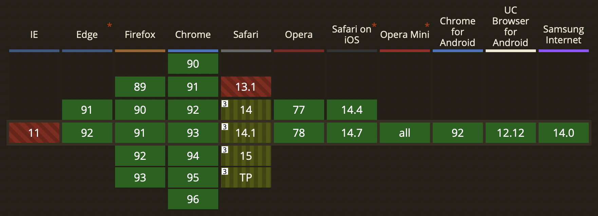

# My About me page

## Creating thumbnail images

### Under macOS

```bash
# create lowres images
mkdir lowres
sips -Z 640 *.jpg -o ./lowres/
sips -Z 640 *.jpeg -o ./lowres/
sips -Z 640 *.png -o ./lowres/
sips -Z 640 *.gif -o ./lowres/
# add _lowres as suffix
cd lowres
for filename in *; do mv -v "${filename}" "${filename%.*}_lowres.${filename##*.}"; done;
# move
cd ..
mv ./lowres/* ./
# remove folder
rm -r lowres
```

## Using `.webp`-format

- Good tutorial: [Embracing modern image formats](https://www.joshwcomeau.com/performance/embracing-modern-image-formats/)
- [`webp` Manual](https://developers.google.com/speed/webp/download)

### Webp Installation under macOS

Don't use the `brew` formula for installing `webp` if you want to use it for compressing `gif` images. For compressing `gif` images, you need the `gif2webp` package, which is not part of the `brew`-`webp` formula unfortunately.

Instead, install `webp` manually:

```bash
wget https://storage.googleapis.com/downloads.webmproject.org/releases/webp/libwebp-1.2.1-mac-10.15.tar.gz  -O /tmp/libwebp-1.2.1-mac-10.15.tar.gz
tar -C /tmp -zxvf /tmp/libwebp-1.2.1-mac-10.15.tar.gz
sudo mv /tmp/libwebp-1.2.1-mac-10.15/bin/* /usr/local/bin/
rm /tmp/libwebp-1.2.1-mac-10.15.tar.gz
rm -r /tmp/libwebp-1.2.1-mac-10.15
```

### `webp cli` Usage

#### Single image

```bash
# -q 75 is the default
cwebp -q 80 image.jpg -o image.webp
gif2webp animated.gif -o animated.webp
```

#### Batch-mode for images

```bash
# all png-files
for filename in *.png; do cwebp -q 80 "${filename}" -o "${filename%.*}.webp"; done;
# all png-files with _lowres suffix
for filename in *_lowres.png; do cwebp -q 80 "${filename}" -o "${filename%.*}.webp"; done;
```

#### Batch-mode for gif

```bash
# all gif-files
for filename in *.gif; do gif2webp -q 80 "${filename}" -o "${filename%.*}.webp"; done;
# all gif-files with _lowres suffix
for filename in *_lowres.gif; do gif2webp -q 80 "${filename}" -o "${filename%.*}.webp"; done;
```

### Safari-Fallback

Safari still does not support `webp`-format: [https://caniuse.com/webp](https://caniuse.com/webp)


So if we simply converted and replaced all of our images and updated our code from this:

```jsx

```

to this:

```jsx

```

This would work fine in browsers like Chrome or Firefox. But it wouldn't work for Safari (and apparently neither for IE11).

We can use following fallback as a solution:

```jsx
<picture>
    <source srcSet='image.webp' type='image/webp' />
    
</picture>
```

From now on, the `picture` element does the heavy lifting for us: if it sees a browser with missing support for the `image/webp`-type, it automatically serves the fallback-resource. Neat 🤗

### Further reading

- [`<source>`-tag with media queries](https://medium.com/front-end-weekly/html-picture-tag-in-practice-png-and-webp-formats-5a3fc51b5998)
- [detect webp support with js](https://ourcodeworld.com/articles/read/630/how-to-detect-if-the-webp-image-format-is-supported-in-the-browser-with-javascript)
- [detect webp support with @supports query](https://stackoverflow.com/questions/60913711/how-to-use-webp-images-and-support-safari)

## Paralax Scroll

- [`react-scroll-parallax`](https://www.npmjs.com/package/react-scroll-parallax)
- [`react-scroll-parallax`-storybook](https://react-scroll-parallax-next.surge.sh/?path=/story/parallaxbanner--with-parallax-disabled)

## Mail forwarding

- Let's say, we wanted to have mails sent to hans@mydomain.com to our private hans@gmail.com mailbox. To set this up, we need to setup a `MX`-record at out `DNS`-management.
- In my case, `netlify` is taking care of all the `DNS`-management.
- We first setup a forwarding with [improvmx.com](https://improvmx.com/), for example: hans@hanskrebs.me shall be forwarded to some private mail.
- Then, we need to setup the `MX`-records in the `netlify`-console as described in this [guide](https://improvmx.com/guides/netlify/) from improvmx.
- And that's it! Just note that you can't use this adress for outgoing e-mails.

## Safari-Fixes

- [Safari Image Size Auto Height CSS](https://stackoverflow.com/questions/10760243/safari-image-size-auto-height-css)
