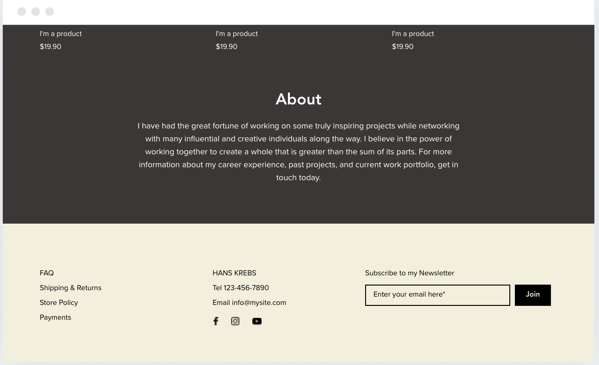
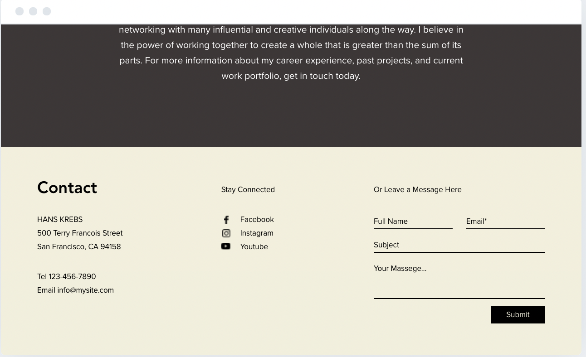
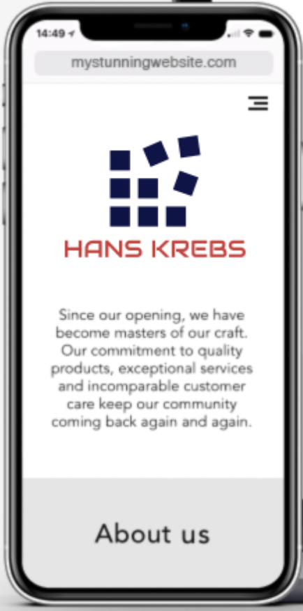

# New Design Concept for v3

<!-- [Wix Editor Url](https://www.wix.com/logo/maker/esh/zoe-editor?industry=%7B%22industry%22%3A%223d95f5101a3e882ac54beba2_a28c5e5ea1945e5fa4ca1728_portfolio%22%2C%22isCustom%22%3Afalse%7D&tags=creative%2Cmodern&selectedWebsiteId=3&logoId=c8caec57-43ad-442a-8851-771896c38b0e&logoPurpose=website&referralAdditionalInfo=arenaSplitPage) -->

## Main Theme

### Main Colors


- rgb(12, 18, 72)
- rgb(178, 178, 178)
- rgb(208, 55, 55)
- rgb(247, 247, 247)
- rgb(255, 255, 255)

### Main Examples


### Main Merchendise


### Main Logo


#### Logo Font


[Audiowide Font @ Google Fonts](https://fonts.google.com/specimen/Audiowide?utm_source=fontsNinja&utm_medium=browserExtension&utm_campaign=foundryLinkAction)

### Main Fonts

- Main font: Avenir, not free!
  - closest to Avenir is Nunito, which is available as [Nunito Google Font](https://fonts.google.com/specimen/Nunito?query=nunito)
- Secondary font: Proxima Nova, not free either!
  - closest to Proxima Nova I choose [Raleway Google Font](https://fonts.google.com/specimen/Raleway)

#### Fonts Installation

```cs
<style>
@import url('https://fonts.googleapis.com/css2?family=Nunito:wght@200;300;400;600;700;800;900&family=Raleway:wght@100;200;300;400;600;800&display=swap');
</style>

font-family: 'Nunito', sans-serif;
font-family: 'Raleway', sans-serif;
```

#### Main Heading1

```css
    width: 435px;
    font-family: Avenir;
    font-size: 34px;
    font-weight: 900;
    line-height: 1.29;
    text-align: center;
    z-index: 99;
    color: #fff;
    text-transform: uppercase;
```

#### Main Subtitle

```css
display: flex;
    align-items: center;
    justify-content: center;
    height: 18px;
    font-family: ProximaNova;
    text-align: center;
    z-index: 99;
    width: 350px;
    font-size: 14px;
    color: #fff;
```

#### Main Heading2

```css
    color: black;
    font-family: Avenir;
    font-size: 16px;
    font-weight: 900;
    text-align: center;
```

#### Main Button

```css
display: flex;
    align-items: center;
    justify-content: center;
    height: 18px;
    font-family: ProximaNova;
    text-align: center;
    z-index: 99;
    width: 62px;
    font-size: 8px;
    margin-top: 13px;
    background-color: rgb(12, 18, 72);
    color: white;
```

#### Main p

```css
    color: black;
    margin-top: 13px;
    width: 350px;
    font-family: ProximaNova;
    font-size: 9px;
    line-height: 1.56;
    text-align: center;
```

## Alternative Theme

### Alternative Colors


- rgb(26, 22, 21)
- rgb(49, 41, 41)
- rgb(61, 55, 55)
- rgb(242, 239, 219)
- rgb(253, 164, 126)

### Alternative Examples







### Alternative Merchendise


### Alternative Logo


### Alternative Fonts

## Responsiveness

### Main Responsiveness


#### Desktop


#### Tablet


#### Mobile



### Alternative Responsivenes


